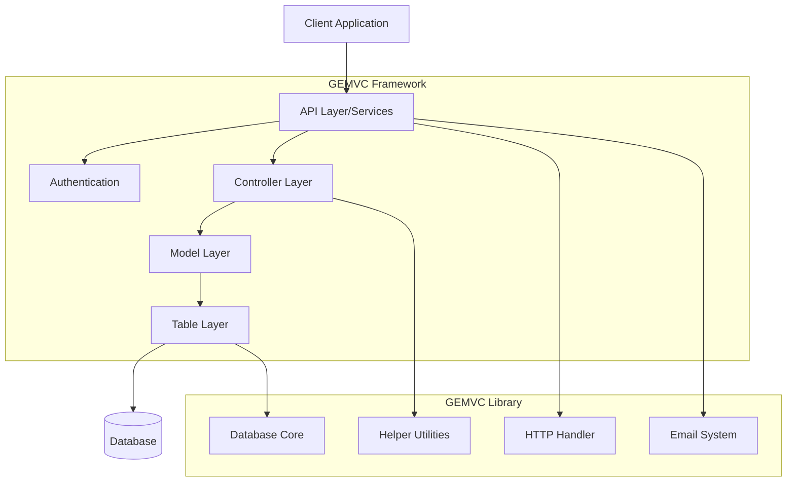
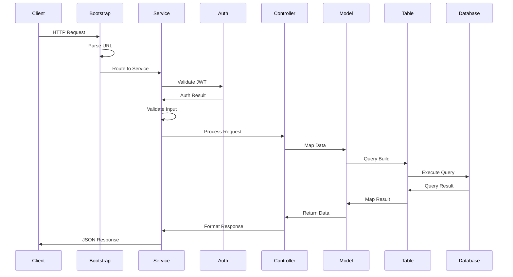

# Gemvc Framework Documentation
**Version:** 5.9.14  
**Author:** Ali Khorsandfard (ali.khorsandfard@gmail.com)  
**License:** MIT

## Table of Contents
1. [Installation & Setup](#installation--setup)
2. [Architecture Overview](#architecture-overview)
3. [Core Components](#core-components)
4. [Framework Layers](#framework-layers)
5. [Request Handling](#request-handling)
6. [Authentication & Authorization](#authentication--authorization)
7. [Database Operations](#database-operations)
8. [Error Handling](#error-handling)
9. [Documentation System](#documentation-system)
10. [Library Integration](#library-integration)
11. [Best Practices](#best-practices)
12. [Environment Configuration](#environment-configuration)
13. [Support & Contributing](#support--contributing)
14. [CLI System](#cli-system)

## Installation & Setup

### Requirements
- PHP >= 8.0
- MySQL/MariaDB
- Composer
- GEMVC Library >= 3.27.8
- PHPStan Level 9 compatibility

### Quick Start
```bash
composer create-project gemvc/installer [your_project_name]
cd [your_project_name]
php -S localhost:8000 -t public
```

### Directory Structure
your_project_name/
├── app/
│   ├── api/              # API Services (extends ApiService/AuthService)
│   ├── controller/       # Business Logic
│   ├── model/           # Data Logic
│   ├── table/           # Database Operations
│   └── .env             # Environment config
├── vendor/
│   ├── gemvc/framework/
│   │   └── src/
│   │       ├── core/    # Framework core
│   │       └── traits/  # Framework traits
│   └── gemvc/library/   # GEMVC Library
├── composer.json
└── index.php

## Architecture Overview

### System Architecture
The GEMVC Framework follows a layered architecture with clear separation of concerns:



### Request-Response Flow
1. **Detailed Request Lifecycle**:



2. **Response Flow**:
```
Database → Table → Model → Controller → Service → Response
```

3. **Return Types**:
- JsonResponse (direct API response)
- Objects (for further processing)
- Simple types (bool, int, string)
- Static method returns

## Core Components

### Bootstrap
The entry point and request lifecycle manager:
```php
// index.php
$request = new ApacheRequest();  // or SwooleRequest
$bootstrap = new Bootstrap($request);
```

Bootstrap handles:
- URL parsing
- Service resolution
- Method execution
- Response validation

### Request Class
Manages all incoming HTTP requests:
- Input validation
- Request sanitization
- JWT handling
- Filtering & sorting
- Pagination support

### ApiService
Base class for all services:
```php
class ApiService {
    protected Request $request;
    
    protected function validatePosts(array $schema): void {
        // Validation logic
    }
}
```

### AuthService
Extended base class for authenticated services:
```php
class AuthService extends ApiService {
    protected Auth $auth;
    protected int $company_id;
    protected int $user_id;
}
```

## Framework Layers

### Request Lifecycle
1. **Request Initialization**
   - Server-specific request creation (Apache/Swoole)
   - Request normalization

2. **Bootstrap Process**
   - URL parsing
   - Service resolution
   - Authentication verification
   - Method execution

3. **Service Processing**
   - Authorization checks
   - Input validation
   - Business logic execution
   - Response generation

### Service Layer

#### Public Services
For unauthenticated endpoints:
```php
class PublicService extends ApiService {
    public function login(): JsonResponse {
        $this->validatePosts(['email' => 'email', 'password' => 'string']);
        // Login logic
    }
}
```

#### Protected Services
For authenticated endpoints:
```php
class SecureService extends ApiService {
    public function create(): JsonResponse {
        $this->auth->authorize(['specific-role']);
        $this->validatePosts(['field' => 'type']);
        return (new Controller($this->request))->create();
    }
}
```

### Controller Layer

#### Architectural Principle
In GEMVC, Controllers should ONLY be called by the Service (API) Layer. This strict architectural rule ensures:

1. **Single Entry Point**
```php
// ✅ CORRECT: Controller called from Service
class UserService extends ApiService {
    public function create(): JsonResponse {
        return (new UserController($this->request))->create();
    }
}

// ❌ WRONG: Never call controllers directly or from other layers
$controller = new UserController($request);  // Don't do this!
```

2. **Clean Architecture Benefits**
- **Single Responsibility**: Services handle API concerns, Controllers handle business logic
- **Separation of Concerns**: Clear boundaries between layers
- **Maintainable Code**: Predictable flow of data and control
- **Security**: All requests go through proper authorization and validation
- **Consistent Error Handling**: Standardized error responses
- **Documentation**: Clear API endpoints through services

3. **Flow of Control**
```
Request → Service (API Layer) → Controller → Response
           ↓
    - Authentication
    - Authorization
    - Input Validation
    - Request Sanitization
```

#### Decoupled Architecture
GEMVC implements a decoupled controller pattern where any Service can use any Controller. This design provides several benefits:

1. **Clean URL Patterns**
```php
// Different URLs can use same controller
/api/classroom/create    →  ClassroomService → ClassroomController
/api/teacher/classrooms  →  TeacherService  → ClassroomController
```

2. **Controller Reusability**
```php
// ClassroomService
class ClassroomService extends AuthService {
    public function create(): JsonResponse {
        $this->auth->authorize(['admin']);
        return (new ClassroomController($this->request))->create();
    }
}

// TeacherService
class TeacherService extends AuthService {
    public function classrooms(): JsonResponse {
        $this->auth->authorize(['teacher']);
        // Reuse ClassroomController for teacher's classrooms
        return (new ClassroomController($this->request))->list();
    }
}
```

#### Key Benefits
- **Clean URLs**: Consistent `/api/service-name/method` pattern
- **Code Reuse**: Same controller can serve multiple services
- **Separation of Concerns**: 
  - Services: Handle auth/validation
  - Controllers: Handle business logic
- **Flexibility**: Any service can use any controller method
- **DRY Principle**: No need to duplicate controller logic

#### Type-Safe Construction
```php
class ClassLessonController extends Controller {
    // Type-safe constructor enables PHPStan level 9!
    public function __construct(Request $request) {
        parent::__construct($request);
    }
}
```

#### Magical mapPost Method
The `mapPost` method is a crucial feature that safely maps request data to objects:

```php
// In Core Controller
class Controller {
    protected Request $request;

    /**
     * @param object $object The object to map the POST data to
     * @info: automatically use $this->request->post to map to Model instance
     */
    public function mapPost(object $object): void {
        $name = get_class($object);
        
        // Validate post data exists
        if (!count($this->request->post)) {
            Response::badRequest("no post data for mapping to $name")->show();
            die();
        }

        // Safe property mapping with type checking
        foreach ($this->request->post as $postName => $value) {
            try {
                if (property_exists($object, $postName)) {
                    $object->$postName = $value;
                }
            } catch (\Exception $e) {
                Response::unprocessableEntity(
                    "post $postName cannot be set to $name: " . $e->getMessage()
                )->show();
                die();
            }
        }
    }
}
```

#### Usage in Controllers
```php
class UserController extends Controller {
    public function create(): JsonResponse {
        $model = new UserModel();
        $this->mapPost($model);  // Type-safe mapping
        return $model->createWithJsonResponse();
    }
}
```

#### Key Benefits
1. **Type Safety**
   - Enables PHPStan level 9
   - Strict type checking
   - Property existence validation
   - Exception handling

2. **Automatic Mapping**
   - No manual property assignment
   - Matches POST keys to object properties
   - Safe type conversion

3. **Error Handling**
   - Clear error messages
   - Type mismatch detection
   - Missing property handling
   - Proper response codes

4. **Code Quality**
   - Reduces boilerplate
   - Prevents type errors
   - Improves maintainability
   - Static analysis friendly

## Authentication & Authorization

### Core Authentication
- JWT token validation through Auth class
- Role-based authorization
- Request validation

### Best Practice: Custom AuthService
Many applications implement a custom base service for authenticated endpoints. For example:

```php
/**
 * Custom base authentication service
 * @hidden
 */
class AuthService extends ApiService {
    protected Auth $auth;
    protected int $company_id;
    protected int $user_id;

    public function __construct(Request $request) {
        parent::__construct($request);
        $this->auth = new Auth($request);
        
        // Custom company context validation
        if (!$this->auth->token || !$this->auth->token->company_id) {
            Response::forbidden('token not belong to company')->show();
            die();
        }
        $this->company_id = $this->auth->token->company_id;

        // Custom user context validation
        if (!$this->auth->token->user_id) {
            Response::forbidden('unknown user')->show();
            die();
        }
        $this->user_id = $this->auth->token->user_id;
    }
}
```

This pattern demonstrates how to extend GEMVC's core authentication to include:
- Company context validation
- User context validation
- Reusable authentication logic
- Consistent error handling

Note: The `AuthService` implementation shown above is a custom best practice example, not part of the core GEMVC Framework.

## Request Handling

### Input Validation
```php
// Core validation
$this->validatePosts([
    'name' => 'string',
    'email' => 'email',
    '?optional' => 'string'
]);

// String length validation
$this->validateStringPosts([
    'username' => '3|15',  // Min 3, Max 15 chars
    'bio' => '|500'       // Max 500 chars
]);
```

### Filtering & Sorting
```php
// URL: api/users?filter_by=country_id=3,status=active
$this->request->filterable([
    'country_id' => 'int',
    'status' => 'string'
]);

// URL: api/users?sort_by=created_at
$this->request->sortable(['created_at', 'name']);
```

### Pagination
```php
// URL: api/users?page_number=1&per_page=20
$this->request->setPageNumber();
$this->request->setPerPage();
```

### API Forwarding
```php
// Forward with current authorization
$response = $this->request->forwardToRemoteApi('http://api.example.com/endpoint');

// Forward with custom authorization
$response = $this->request->forwardPost('http://api.example.com/endpoint', $authHeader);
```

## Error Handling

### Overview
GEMVC provides a standardized error handling system across all layers:
- Consistent error responses
- Type-safe exception handling
- Validation error management
- HTTP status code alignment

### Standard Error Responses

1. **Basic Error Types**
```php
// Validation error
return $this->error('Validation failed', 422, $errors);

// Not found error
return $this->error('Resource not found', 404);

// Server error
return $this->error('Internal server error', 500);

// Success response
return $this->success(['data' => $result]);
```

2. **Exception Handling Pattern**
```php
try {
    $result = $this->process();
    return $this->success($result);
} catch (ValidationException $e) {
    return $this->error($e->getMessage(), 422);
} catch (ModelNotFoundException $e) {
    return $this->error('Resource not found', 404);
} catch (Exception $e) {
    return $this->error('An error occurred', 500);
}
```

## Documentation System

### Overview
GEMVC automatically generates API documentation from your code with:
- Endpoint listings
- Request/response schemas
- Authentication requirements
- Input validation rules
- Example responses

### Documentation Features

1. **Auto-Generated Documentation**
- Service endpoints
- Method parameters
- Response formats
- Validation rules
- Authentication requirements

2. **Documentation Directives**
```php
/**
 * @hidden
 * This service won't appear in API documentation
 */
class InternalService extends ApiService {
    /**
     * @hidden
     * This method will also be hidden
     */
    public function internalMethod(): JsonResponse {
    }
}
```

3. **Mock Response System**
```php
public static function mockResponse(string $method): array {
    return match($method) {
        'create' => [
            'success' => true,
            'data' => [
                'id' => 1,
                'name' => 'Example'
            ]
        ],
        default => ['success' => false]
    };
}
```

### Advanced Documentation
Additional documentation directives and features are available:
- Method grouping
- API versioning
- Response examples
- Security specifications

## Best Practices

### Service Layer Best Practices

1. **Standard Service Structure**
```php
class UserService extends AuthService {
    public function create(): JsonResponse {
        // 1. Authorization first
        $this->auth->authorize(['admin']);
        
        // 2. Validation second
        $this->validatePosts([
            'name' => 'required|string',
            'email' => 'required|email'
        ]);
        
        // 3. Controller call last
        return (new UserController($this->request))->create();
    }
}
```

2. **Key Principles**
- Always extend ApiService or AuthService
- Validate inputs before processing
- Use authorization before business logic
- Follow consistent method naming
- Return JsonResponse types

### Controller Layer Best Practices

1. **Controller Rules**
- Only called by Services
- Use mapPost for data binding
- Return JsonResponse
- Keep business logic isolated
- Follow single responsibility

2. **Type Safety**
```php
class UserController extends Controller {
    public function create(): JsonResponse {
        $model = new UserModel();
        $this->mapPost($model);  // Type-safe mapping
        return $model->createWithJsonResponse();
    }
}
```

### Model Layer Best Practices

1. **Property Naming**
```php
class UserModel extends UserTable {
    //Table layer  Database properties
    //public int $id;  which is inherited from UserTable 
    //public string $name; which is inherited from UserTable 
    
    // Non-DB properties (other Model) start with underscore
    /** @var array<RoleModel> */
    public array $_roles;
}
```

2. **Model Guidelines**
- Use type declarations
- Document complex properties
- Prefix non-DB fields with underscore
- Extend appropriate Table class
- Implement relevant traits

### Data Handling Best Practices

1. **Input Validation**
```php
// Always validate at service level
$this->validatePosts([
    'name' => 'required|string',
    'email' => 'required|email',
    '?optional' => 'string'
]);
```

2. **Error Handling**
```php
try {
    // Process data
    return $this->success($result);
} catch (ValidationException $e) {
    return $this->error($e->getMessage(), 422);
}
```

### Security Best Practices

1. **Authentication**
- Always validate JWT tokens
- Check role permissions
- Validate company context
- Verify user context

2. **Data Protection**
```php
class AuthService extends ApiService {
    public function __construct(Request $request) {
        parent::__construct($request);
        $this->auth = new Auth($request);
        
        // Always validate context
        if (!$this->auth->token || !$this->auth->token->company_id) {
            Response::forbidden('token not belong to company')->show();
            die();
        }
    }
}
```

### Code Quality Best Practices

1. **Type Safety**
- Enable PHPStan level 9
- Use strict type declarations
- Document complex types
- Validate property existence

2. **Code Organization**
- Follow consistent naming
- Use appropriate traits
- Maintain layer separation
- Document public methods

## Library Integration

### Overview
The GEMVC Framework is built on top of the GEMVC Library. For detailed library documentation, refer to:
- `/vendor/gemvc/library/Documentation.md`
- `/vendor/gemvc/library/AIAssist.jsonc`

### Architecture Flow
GEMVC Framework (API Layer)
         ↓
GEMVC Library (Core Layer)
         ↓
    PHP Core
```

### Library Components
1. **HTTP Layer** (`http/`)
   - Request/response handling
   - Input validation
   - JWT processing
   - API routing

2. **Database Layer** (`database/`)
   - Query building
   - Database operations
   - Connection management
   - Transaction handling

3. **Helper Layer** (`helper/`)
   - File operations
   - Image processing
   - Security utilities
   - Validation helpers

4. **Email System** (`email/`)
   - Email handling
   - Template processing
   - SMTP integration

### Integration Patterns

1. **HTTP Layer Integration**
```php
// Library base class
namespace Gemvc\Library\Http;
class Request { /* base functionality */ }

// Framework extension
namespace Gemvc\Framework\Core;
class ApiService {
    protected Request $request;  // Uses Library's Request
    // Adds API-specific features
}
```

2. **Database Layer Integration**
```php
// Library base class
namespace Gemvc\Library\Database;
class QueryBuilder { /* base queries */ }

// Framework extension
namespace Gemvc\Framework\Core;
class Table extends QueryBuilder {
    // Adds API-specific methods
}
```

3. **Helper Integration**
```php
// Library utilities
namespace Gemvc\Library\Helper;
class FileHelper { /* file operations */ }
class ImageHelper { /* image processing */ }

// Framework usage
use Gemvc\Library\Helper\FileHelper;
class UploadService extends ApiService {
    public function upload() {
        $file = new FileHelper($_FILES['upload']);
        // Framework-specific logic
    }
}
```

4. **Email Integration**
```php
// Library email system
namespace Gemvc\Library\Email;
class EmailSender { /* email operations */ }

// Framework integration
use Gemvc\Library\Email\EmailSender;
class NotificationService extends ApiService {
    protected EmailSender $emailSender;
}
```

### Core Dependencies

1. **Database Core**
```php
use Gemvc\Library\Database\{
    QueryBuilder,
    PdoQuery,
    QueryExecuter
};
// Framework's Table system extends these
```

2. **HTTP Foundation**
```php
use Gemvc\Library\Http\{
    Request,
    Response,
    JsonResponse
};
// Framework's API layer is built on these
```

3. **Helper Utilities**
```php
use Gemvc\Library\Helper\{
    FileHelper,
    ImageHelper,
    SecurityHelper,
    ValidationHelper
};
// Framework uses these for core operations
```

### Request-Response Flow

1. **Request Flow**
```
Client Request
↓
Library HTTP Handler (base processing)
↓
Framework Bootstrap (API routing)
↓
Framework Service (API logic)
↓
Library Database (data operations)
```

2. **Response Flow**
```
Library Database Result
↓
Framework Model Processing
↓
Framework Controller Logic
↓
Library Response Formatting
↓
Client Response
```

### Library Extension Points

1. **Database Layer**
```php
// Library base
namespace Gemvc\Library\Database;
class QueryBuilder {
    protected function buildQuery() {}
}

// Framework extension
namespace Gemvc\Framework\Core;
class Table extends QueryBuilder {
    // Adds API-specific query building
    public function createWithJsonResponse(): JsonResponse {}
}
```

2. **Request Processing**
```php
// Library base
namespace Gemvc\Library\Http;
class Request {
    public function validate() {}
}

// Framework extension
namespace Gemvc\Framework\Core;
class ApiService {
    protected Request $request;
    // Adds API-specific validation
    public function validatePosts() {}
}
```

### Version Compatibility

The framework version 5.9.14 requires:
- GEMVC Library ≥ 3.27.8
- PHP ≥ 8.0
- PHPStan Level 9 compatibility

Key compatibility points:
1. Database interface versions
2. HTTP component versions
3. Helper utility versions

### Key Integration Points
1. Framework extends library base classes
2. Framework uses library utilities directly
3. Framework adds API-specific layers
4. Framework provides trait system for extensions
```

## Database Operations

### Overview
GEMVC provides a robust database layer built on top of the Library's QueryBuilder:
- Type-safe database operations
- CRUD functionality
- Transaction support
- Query building
- Relationship handling

### Table Layer

1. **Basic Table Structure**
```php
class UserTable extends Table {
    protected string $table = 'users';
    protected string $primary_key = 'id';
    
    // Optional: Define relationships
    protected array $relations = [
        'roles' => ['type' => 'many', 'table' => 'user_roles']
    ];
}
```

2. **CRUD Operations**
```php
class UserTable extends Table {
    // Create
    public function create(array $data): int {
        return $this->insert($data);
    }

    // Read
    public function findById(int $id): ?object {
        return $this->where('id', $id)->first();
    }

    // Update
    public function updateUser(int $id, array $data): bool {
        return $this->where('id', $id)->update($data);
    }

    // Delete
    public function remove(int $id): bool {
        return $this->where('id', $id)->delete();
    }
}
```

### Query Building

1. **Basic Queries**
```php
// Select with conditions
$users = $this->table
    ->select(['id', 'name', 'email'])
    ->where('status', 'active')
    ->get();

// Complex conditions
$results = $this->table
    ->where('age', '>', 18)
    ->whereIn('role', ['admin', 'manager'])
    ->orderBy('created_at', 'DESC')
    ->limit(10)
    ->get();
```

2. **Relationships**
```php
// Define relationship
protected array $relations = [
    'posts' => [
        'type' => 'many',
        'table' => 'posts',
        'foreign_key' => 'user_id'
    ]
];

// Use relationship
$userWithPosts = $this->table
    ->with('posts')
    ->where('id', $userId)
    ->first();
```

### Transactions

1. **Basic Transaction**
```php
try {
    $this->beginTransaction();
    
    $userId = $this->users->create($userData);
    $this->profiles->create(['user_id' => $userId, ...]);
    
    $this->commit();
    return true;
} catch (Exception $e) {
    $this->rollback();
    return false;
}
```

2. **Nested Transactions**
```php
$this->beginTransaction();
try {
    // First operation
    $this->beginTransaction();
    $this->users->create($userData);
    $this->commit();

    // Second operation
    $this->beginTransaction();
    $this->profiles->create($profileData);
    $this->commit();

    $this->commit();
} catch (Exception $e) {
    $this->rollback();
    throw $e;
}
```

### Model Integration

1. **Table-Model Binding**
```php
class UserModel extends UserTable {
    public int $id;
    public string $name;
    public string $email;
    
    // Non-DB properties
    public array $_roles;
}
```

2. **Type-Safe Operations**
```php
class UserModel extends UserTable {
    public function createWithValidation(): JsonResponse {
        $this->validate();
        $id = $this->create([
            'name' => $this->name,
            'email' => $this->email
        ]);
        return $this->success(['id' => $id]);
    }
}
```

### Query Optimization

1. **Index Usage**
```php
// Efficient query using indexes
$result = $this->table
    ->select(['id', 'name'])
    ->where('email', $email)  // Assuming email is indexed
    ->first();
```

2. **Eager Loading**
```php
// Prevent N+1 problems
$users = $this->table
    ->with(['posts', 'profile'])
    ->where('status', 'active')
    ->get();
```

### Best Practices

1. **Query Building**
- Use prepared statements (automatic)
- Leverage indexes
- Implement pagination
- Use eager loading
- Keep transactions short

2. **Data Protection**
- Validate before insert/update
- Use type declarations
- Implement soft deletes
- Handle relationships carefully
```

## Support & Contributing

### Getting Support

1. **Documentation Resources**
- Official Documentation: `/vendor/gemvc/library/Documentation.md`
- API Reference: `/vendor/gemvc/library/APIReference.json`
- AI Assist Guide: `/vendor/gemvc/library/AIAssist.jsonc`

2. **Community Support**
- GitHub Issues: Report bugs and feature requests
- Discussion Forum: Ask questions and share solutions
- Stack Overflow: Tag questions with `gemvc`

### Reporting Issues

1. **Bug Reports**
```php
// Include minimal reproduction code
class ExampleController extends Controller {
    public function problematicMethod(): JsonResponse {
        // Code that demonstrates the issue
        return $this->error('Description of the problem');
    }
}
```

2. **Issue Template**
```markdown
### Description
[Clear description of the issue]

### Steps to Reproduce
1. [First Step]
2. [Second Step]
3. [Additional Steps...]

### Expected Behavior
[What you expected to happen]

### Actual Behavior
[What actually happened]

### Environment
- GEMVC Version: 5.9.14
- PHP Version: 8.0
- Database: MySQL 8.0
```

### Contributing Guidelines

1. **Code Style**
- Follow PSR-12 coding standards
- Maintain PHPStan level 9 compatibility
- Include type declarations
- Document public methods
- Write unit tests

2. **Pull Request Process**
```bash
# Fork and clone the repository
git clone https://github.com/your-username/gemvc.git
cd gemvc

# Create a feature branch
git checkout -b feature/your-feature-name

# Make your changes
# Add tests
# Update documentation

# Submit pull request
```

### Development Setup

1. **Local Development**
```bash
# Install dependencies
composer install

# Run tests
./vendor/bin/phpunit

# Check code style
./vendor/bin/phpcs

# Static analysis
./vendor/bin/phpstan analyse
```

2. **Testing Guidelines**
```php
class ExampleTest extends TestCase {
    public function testFeature(): void {
        // Arrange
        $service = new ExampleService($request);

        // Act
        $response = $service->process();

        // Assert
        $this->assertInstanceOf(JsonResponse::class, $response);
        $this->assertTrue($response->isSuccess());
    }
}
```

### Documentation Contributions

1. **Documentation Standards**
- Clear, concise explanations
- Practical code examples
- Proper markdown formatting
- Updated table of contents
- Version-specific notes

2. **Example Documentation**
```php
/**
 * Processes the user request with validation
 *
 * @param array<string, mixed> $data Input data
 * @return JsonResponse
 * @throws ValidationException When validation fails
 *
 * @example
 * $service = new UserService($request);
 * $response = $service->process([
 *     'name' => 'John Doe',
 *     'email' => 'john@example.com'
 * ]);
 */
public function process(array $data): JsonResponse {
    // Implementation
}
```

### Version Control

1. **Branching Strategy**
```bash
# Stable release branch
git checkout -b main

# Development branch
git checkout -b develop

# Feature branches
git checkout -b feature/your-feature-name

# Hotfix branches
git checkout -b hotfix/your-hotfix-name
```

2. **Commit Guidelines**
```
feat: Add new feature
fix: Bug fix
docs: Documentation changes
test: Add or update tests
refactor: Code refactoring
style: Code style changes
```

### Release Process

1. **Version Numbering**
- Major.Minor.Patch (e.g., 5.9.14)
- Follow semantic versioning
- Document breaking changes

2. **Release Checklist**
```markdown
- [ ] Update version number
- [ ] Run full test suite
- [ ] Update changelog
- [ ] Update documentation
- [ ] Tag release
- [ ] Update composer.json
```

### Community Guidelines

1. **Code of Conduct**
- Be respectful and inclusive
- Focus on constructive feedback
- Help others learn
- Follow project standards

2. **Support Channels**
- GitHub Issues: Bug reports
- Discussions: Questions
- Email: Security issues
- Wiki: Documentation

### Security Policy

1. **Reporting Security Issues**
- Email: security@gemvc.com
- Do not disclose publicly
- Include detailed information
- Expect acknowledgment

2. **Security Best Practices**
```php
// Always validate input
$this->validatePosts([
    'email' => 'email|required',
    'token' => 'string|required'
]);

// Use proper authentication
$this->auth->authorize(['admin']);

// Sanitize output
return $this->success(
    SecurityHelper::sanitize($data)
);
```

This completes the full reorganization of the documentation. The document now includes all major sections with clear structure, examples, and guidelines. Would you like me to review any specific section in more detail or make any adjustments to the organization?

### Bootstrap Implementation
The framework is initialized in your project's `index.php`:

```php
// Required at project root: index.php
require_once 'vendor/autoload.php';

use Gemvc\Core\Bootstrap;
use Gemvc\Http\ApacheRequest;
use Gemvc\Http\NoCors;
use Symfony\Component\Dotenv\Dotenv;

// Handle CORS
NoCors::NoCors();

// Load environment variables
$dotenv = new Dotenv();
$dotenv->load(__DIR__.'/app/.env');

// Initialize framework
$webserver = new ApacheRequest();
$bootstrap = new Bootstrap($webserver->request);
```

Key components:
1. **CORS Handling**: `NoCors::NoCors()`
2. **Environment Loading**: Using Symfony Dotenv
3. **Request Initialization**: `ApacheRequest`
4. **Framework Bootstrap**: `Bootstrap` class
```

## CLI System

### Overview
GEMVC Framework includes a CLI system for rapid development:

```bash
vendor/bin/gemvc create:service ServiceName
```

### Generated Components

1. **Service Layer** (`app/api/ServiceName.php`)
```php
class ServiceName extends ApiService {
    public function create(): JsonResponse {
        $this->validatePosts([
            'name' => 'string',
            'description' => 'string'
        ]);
        return (new ServiceNameController($this->request))->create();
    }
}
```

2. **Controller Layer** (`app/controller/ServiceNameController.php`)
```php
class ServiceNameController extends Controller {
    public function create(): JsonResponse {
        $model = new ServiceNameModel();
        $this->mapPost($model);
        return $model->createModel();
    }
}
```

3. **Model Layer** (`app/model/ServiceNameModel.php`)
```php
class ServiceNameModel extends ServiceNameTable {
    public function createModel(): JsonResponse {
        $success = $this->insert();
        return Response::created($success, 1, "Created successfully");
    }
}
```

4. **Table Layer** (`app/table/ServiceNameTable.php`)
```php
class ServiceNameTable extends CRUDTable {
    public int $id;
    public string $name;
    public string $description;

    public function getTable(): string {
        return 'service_names';
    }
}
```

### Generated Endpoints
Each service includes these endpoints:
1. `POST /api/service/create` - Create new record
2. `GET /api/service/read/?id=1` - Read single record
3. `POST /api/service/update` - Update record
4. `POST /api/service/delete` - Delete record
5. `GET /api/service/list` - List records with filtering/sorting
```

## Type Safety

The GEMVC Framework leverages PHP 8's type system features including:
- Union Types
- Nullable Types
- Return Type Declarations
- Property Type Declarations
- Constructor Property Promotion
- Match Expressions

Example:
```php
public function processRequest(
    RequestInterface $request, 
    ?array $options = null
): Response|JsonResponse {
    $result = match ($request->getMethod()) {
        'GET' => $this->handleGet($request),
        'POST' => $this->handlePost($request),
        default => throw new InvalidMethodException()
    };
    
    return $this->formatResponse($result);
}
```